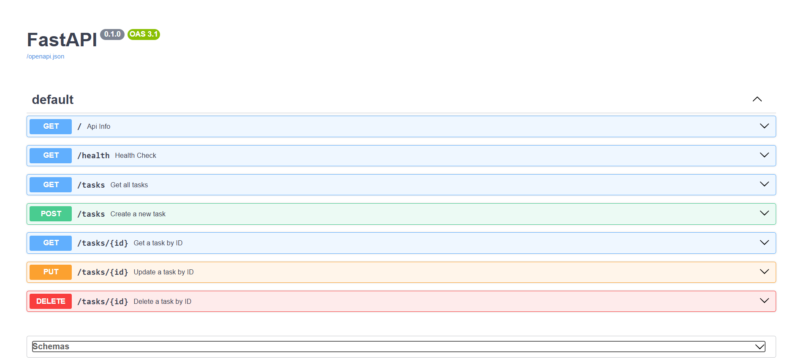

# CRUD API Project

A simple task management API built with FastAPI, supporting full CRUD operations (Create, Read, Update, Delete) with in-memory storage.

## Setup & Run

```powershell
python -m venv venv
venv\Scripts\activate
pip install fastapi uvicorn
python -m uvicorn main:app --reload
```

Server runs at `http://localhost:8000`. Interactive docs available at `http://localhost:8000/docs`.

## Endpoints

| Endpoint | Method | Success | Failure |
|---|---|---|---|
| `/tasks` | GET | 200 - returns list of all tasks | - |
| `/tasks` | POST | 201 - task created | 400 - title is empty |
| `/tasks/{id}` | GET | 200 - returns the task | 404 - id not found |
| `/tasks/{id}` | PUT | 200 - returns updated task | 400 - no fields provided, or 404 - id not found |
| `/tasks/{id}` | DELETE | 204 - task deleted | 404 - id not found |

## Example Request

```powershell
curl -i http://localhost:8000/tasks
```

```
HTTP/1.1 200 OK
date: Wed, 05 Aug 2026 16:38:25 GMT
server: uvicorn
content-length: 117
content-type: application/json

[{"title":"Task_1","id":0,"done":true},{"title":"Task_2","id":1,"done":false},{"title":"Task_3","id":2,"done":false}]
```

## Swagger UI

